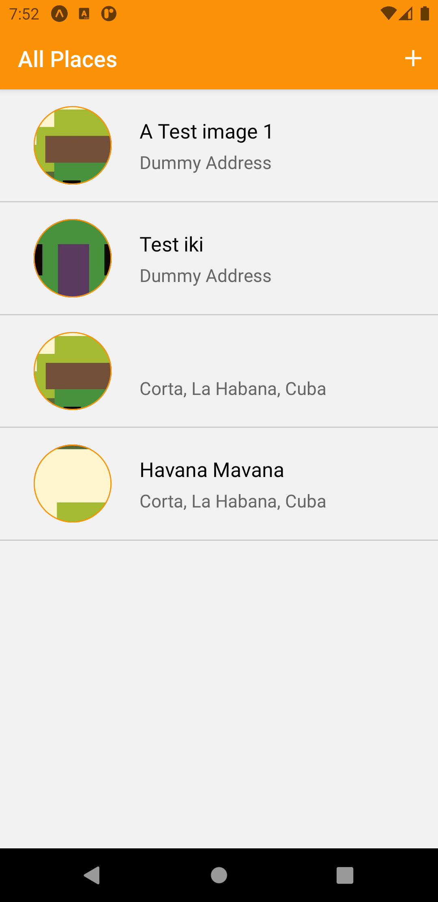
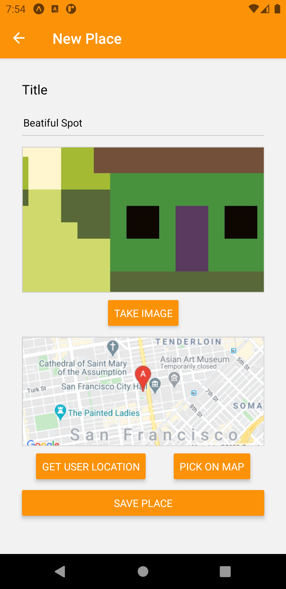
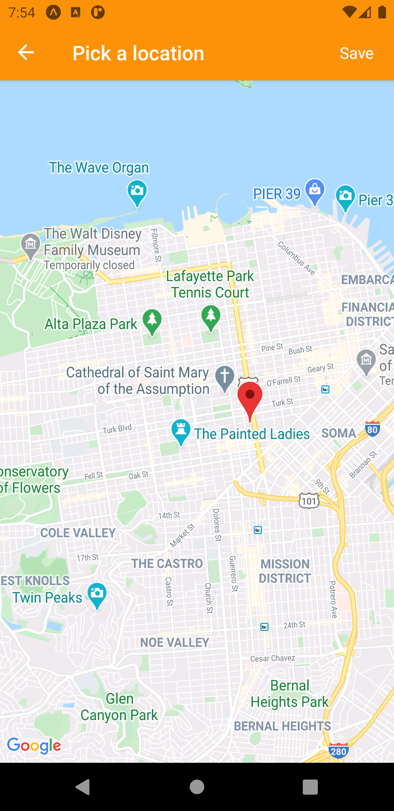
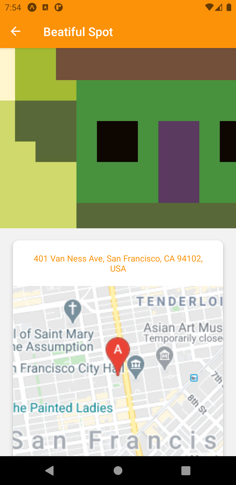
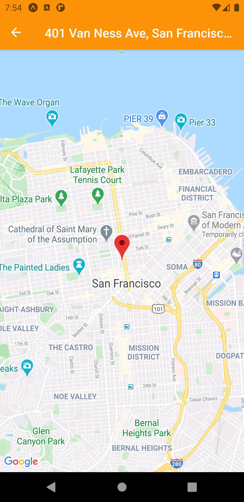
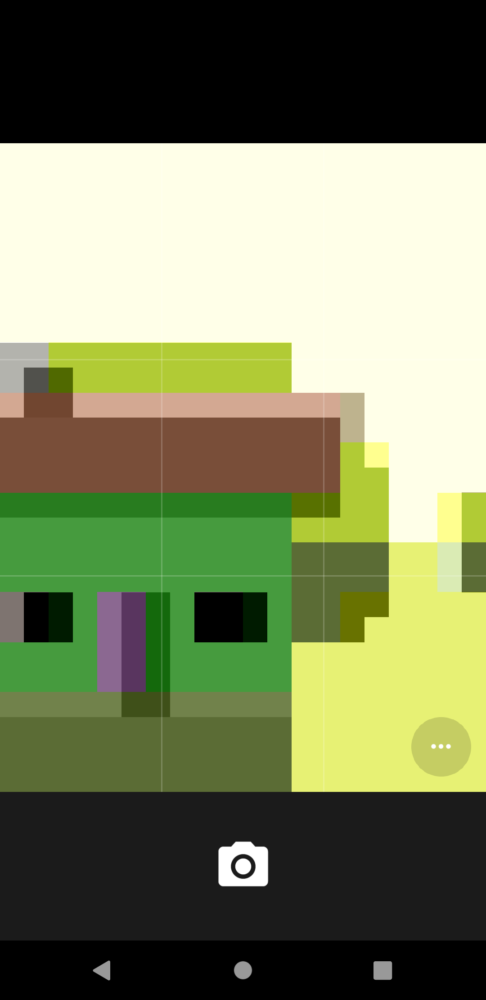

# Expo Bare Workflow

> started as Expo managed app, then ejected.

To revert the changes after this command completes, you can run the following:

```
git clean --force && git reset --hard
```

# Eject Output:

\$ expo eject
Your git working tree is clean
To revert the changes after this command completes, you can run the following:
git clean --force && git reset --hard

� Android package Learn more: https://expo.fyi/android-package

? What would you like your Android package name to be? com.halo.places

� iOS Bundle Identifier Learn more: https://expo.fyi/bundle-identifier

? What would you like your iOS bundle identifier to be? com.halo.places

✔ App configuration (app.json) updated.
✔ Created native project directories (./ios and ./android) and updated .gitignore.
✔ Added Metro bundler configuration.
✔ Updated package.json and added index.js entry point for iOS and Android.
✔ Installed JavaScript dependencies.

\ Applying iOS configuration
Using node to generate images. This is much slower than using native packages.
› Optionally you can stop the process and try again after successfully running `npm install -g sharp-cli`.

⚠️ iOS configuration applied with warnings that should be fixed:

- splash: This is the image that your app uses on the loading screen, we recommend installing and using expo-splash-screen. Learn more: https://github.com/expo/expo/blob/master/packages/expo-splash-screen/README.md
  ⚠️ Android configuration applied with warnings that should be fixed:
- splash: This is the image that your app uses on the loading screen, we recommend installing and using expo-splash-screen. Learn more: https://github.com/expo/expo/blob/master/packages/expo-splash-screen/README.md
  ✔ Skipped installing CocoaPods because operating system is not on macOS.

⚠️ Your app includes 1 package that requires additional setup in order to run:

- expo-image-picker: https://github.com/expo/expo/tree/master/packages/expo-image-picker

➡️ Next steps

- � You may want to run npx @react-native-community/cli doctor to help install any tools that your app may
  need to run your native projects.
- � When CocoaPods is installed, initialize the project workspace: npx pod-install
- � Download your Android keystore (if you're not sure if you need to, just run the command and see): expo
  fetch:android:keystore

☑️ When you are ready to run your project
To compile and run your project in development, execute one of the following commands:

- npm run ios
- npm run android
- npm run web

# App Info

> In this app you can find:

- React Navigation 5 usage (sending & receiving parameters between screens & components & navigator)
- Camera usage
- Temp storage usage
- SQLite usage
- Google Maps usage
- ENV vars usage (& keeping them secret)

# Screenshots

<div style="display: flex;">






</div>

# Some important installations

expo install expo-image-picker

expo install expo-permissions

expo install expo-file-system

expo install expo-sqlite

expo install expo-location

npm install react-native-dotenv //SEEMS NO NEED !!! (check r_shop_app README.md)

expo install react-native-maps

The steps defined under "Configuration" section might be required in the MapView Expo API Reference
(https://docs.expo.io/versions/v38.0.0/sdk/map-view/)

# Google: Maps Static API

https://developers.google.com/maps/documentation/maps-static/overview

The Maps Static API lets you embed a Google Maps image on your web page without requiring JavaScript or any dynamic page loading. The Maps Static API service creates your map based on URL parameters sent through a standard HTTP request and returns the map as an image you can display on your web page. You don't need to do anything "special" to get this image to show up on the page. No JavaScript is required. All we needed to do was create a URL, and place it within an  tag. You can place a Google Static Maps anywhere on your webpage where you can place an image.

```
https://maps.googleapis.com/maps/api/staticmap?center=Brooklyn+Bridge,New+York,NY&zoom=13&size=600x300&maptype=roadmap
&markers=color:blue%7Clabel:S%7C40.702147,-74.015794&markers=color:green%7Clabel:G%7C40.711614,-74.012318
&markers=color:red%7Clabel:C%7C40.718217,-73.998284
&key=YOUR_API_KEY
```

# Google: Geocoding API

https://developers.google.com/maps/documentation/geocoding/overview

> What is geocoding?

Geocoding is the process of converting addresses (like "1600 Amphitheatre Parkway, Mountain View, CA") into geographic coordinates (like latitude 37.423021 and longitude -122.083739), which you can use to place markers on a map, or position the map.

> Reverse geocoding (address lookup)

The term geocoding generally refers to translating a human-readable address into a location on a map. The process of doing the opposite, translating a location on the map into a human-readable address, is known as reverse geocoding.
